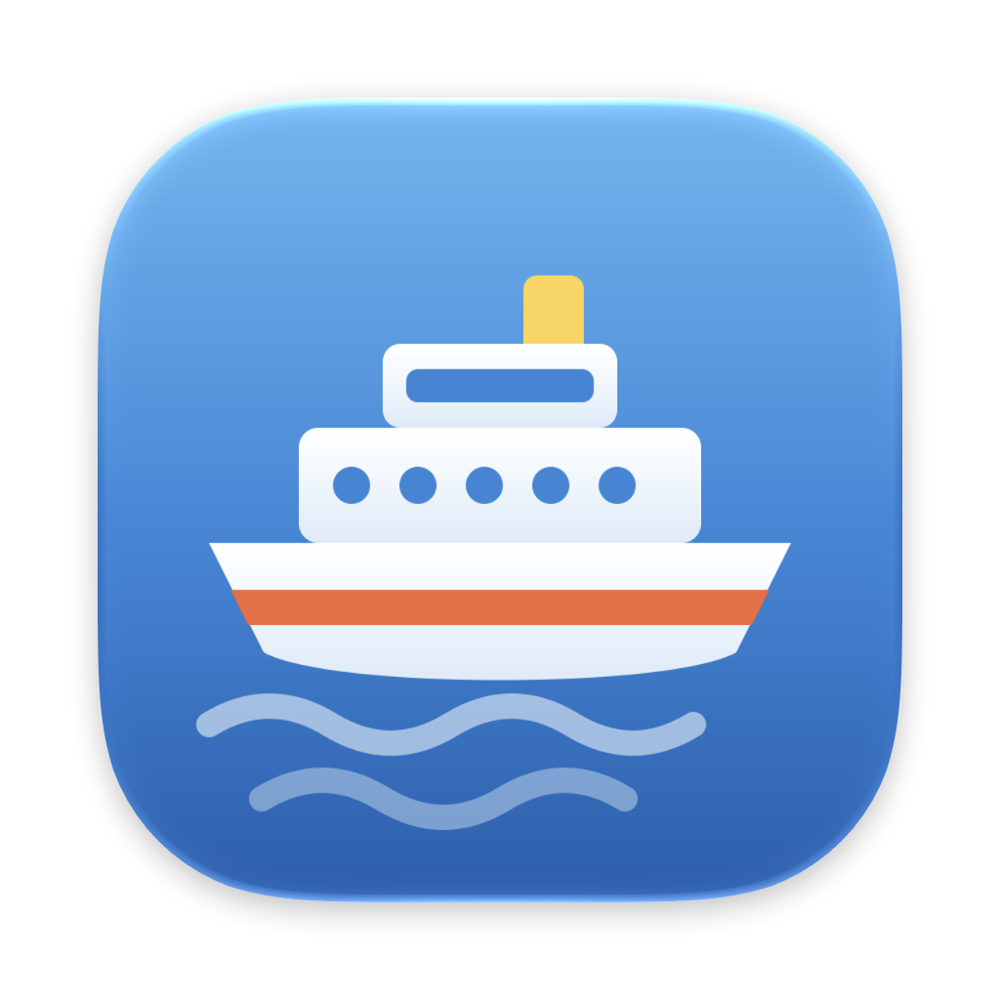
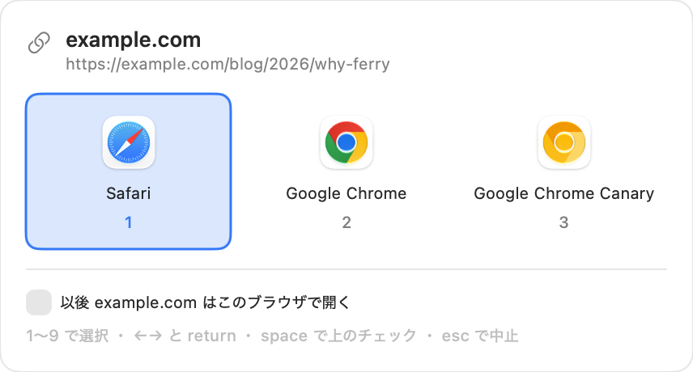

# Ferry

**リンクを開くブラウザを選べる、macOS の既定ブラウザアプリ。**

メールや Discord から来た URL を Ferry がいったん受け取り、ルールに一致すれば
そのままそのブラウザで開く。一致しなければカーソルのそばにパネルを出して選ばせる。

```
Discord / メール ──▶ Ferry ──┬─ ルール一致 ──▶ Chrome / Safari / …
                             └─ 不一致 ──▶ [ 選択パネル ]
```



## できること

- **行き先ごとにブラウザを振り分ける。** ホストの後方一致（`github.com` は
  `gist.github.com` にも当たる）、ワイルドカード、正規表現の3種類
- **パネルから1操作でルールを作る。** `space` を押してから番号を押すと
  「以後このホストはこのブラウザ」を覚える。設定画面はほとんど開かなくてよい
- **開く前に URL を整える。** 短縮URLを展開し、`utm_*` や `fbclid` を落とす
- **option を押しながらのクリック**でルールを無視してパネルを出す
- **一時停止**と**元の既定ブラウザへの復元**。既定ブラウザを乗っ取る以上、
  リンクが開けなくなる事態を作らないことを設計の前提にしている

## 必要なもの

macOS 14 以降。外部の依存パッケージは無い。

## 入れる

```bash
git clone https://github.com/YoshitoSuzuki/macOS-Ferry.git
cd macOS-Ferry
./build.sh install        # ~/Applications/Ferry.app に入れて起動する
```

メニューバーの船アイコン → 設定… → 「Ferry を既定のブラウザにする」。
切り替える前の既定ブラウザが控えられ、同じ画面から戻せる。

ad-hoc 署名なので、配布されたバイナリではなく手元でビルドして使う想定。

## ドキュメント

- [overview.md](docs/overview.md) — 何を作ったか、なぜか
- [usage.md](docs/usage.md) — 使い方
- [architecture.md](docs/architecture.md) — 仕組みと気をつけた点
- [build.md](docs/build.md) — ビルド
- [history.md](docs/history.md) — 変更の記録と今後

## ライセンス

[MIT](LICENSE)
